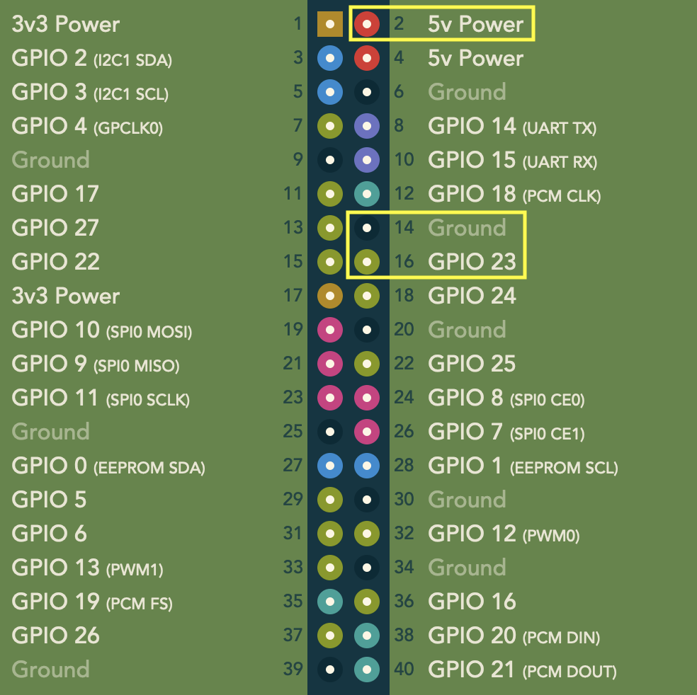
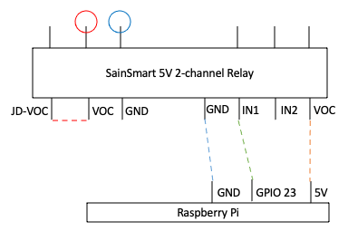

# external_power_up
Close SainSmart Relay Switch while Raspberry Pi is turned on.


# How it works
This program closes the SainSmart Relay Switch as soon as the Raspberry Pi boots up and leaves it that way until the Pi has been turned off. This is to turn on other externally powered devices that need to be on while the Pi is on, and off when the Pi is turned off or turned into StandBy mode.



Example setup:



If you are using a GPIO different than 23, update the line in the program accordingly:

```python
trigger_pin = LED(23)
```


# Install

On your Raspberry Pi:

```sh
git clone https://github.com/koen-aerts/external_power_up.git
cd external_power_up
sudo cp external_power_up.py /usr/local/bin/
sudo chmod +x /usr/local/bin/external_power_up.py
sudo cp external_power_up.service /lib/systemd/system/
sudo systemctl enable external_power_up.service
sudo systemctl start external_power_up.service
```


# Reference
[https://koenaerts.ca/arcade1up-mod/build-power-supply/](https://koenaerts.ca/arcade1up-mod/build-power-supply/)
